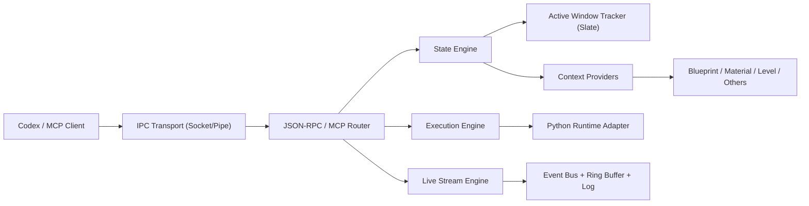

# Loomle Bridge Next: Overall Design (Greenfield)

## 1. Goal

Design a new Loomle Bridge as a local, deterministic, high-reliability control plane for Unreal Editor.

Primary goals:

1. One unified state interface for agent consumption.
2. Accurate active-window awareness across Unreal editor surfaces.
3. Strong execution safety and observability for Python actions.
4. Event-driven real-time model with incremental pull semantics.
5. Clean extension model for new editor domains.

Non-goals:

1. Compatibility constraints from previous bridge versions.
2. Remote network exposure.
3. Long-running business logic in bridge process.

## 2. System Overview

Bridge runs inside UE Editor as a plugin module and exposes a local MCP-compatible JSON-RPC endpoint over IPC.

High-level layers:

1. Transport Layer
2. Protocol Layer
3. State Engine
4. Execution Engine
5. Event Stream Engine
6. Provider Framework
7. Policy/Security/Telemetry



## 3. API Surface

Only four tools are exposed:

1. `loomle`: health and capability introspection
2. `context`: unified snapshot API (lightweight selection index by default, optional value resolution by ids)
3. `live`: incremental event pull by cursor
4. `execute`: policy-gated Python execution

No separate `selection` endpoint. Selection is part of `context`.

`context` request parameters:

1. `resolveIds` (optional string array): object ids that require resolved values.
2. `resolveFields` (optional string array): value field allowlist for resolved objects.

Default behavior:

1. If `selection.count == 1`, auto-resolve and return that single object's values inline.
2. If `selection.count > 1`, return selection index only.
3. For multi-select detail fetch, client can pass `resolveIds`.
4. `resolveFields` can restrict returned value fields.

## 4. Transport and Session

Transport:

1. Windows: named pipe
2. macOS/Linux: unix domain socket
3. Frame format: NDJSON (one JSON object per line)

Session model:

1. Stateless request/response for tool calls.
2. Shared in-process state cache for active window and live events.
3. Optional client session id in request metadata for observability only.

## 5. Unified `context` Contract

`context` always returns full snapshot envelope:

1. Global runtime state
2. Active window/editor state
3. Active asset/workspace state
4. Normalized selection index (`selection.items`)
5. Optional resolved values (`selection.resolvedValues`) for `resolveIds`
6. Optional provider-specific details

Example shape:

```json
{
  "isError": false,
  "timestamp": "2026-03-03T12:34:56Z",
  "runtime": {
    "projectName": "Loomle",
    "projectFilePath": ".../Loomle.uproject",
    "isPIE": false,
    "editorWorld": "Untitled",
    "engineVersion": "5.7.x"
  },
  "activeWindow": {
    "windowId": "stable-hash",
    "windowTitle": "BP_Player",
    "editorType": "blueprint",
    "tabType": "Document",
    "isForeground": true
  },
  "asset": {
    "assetPath": "/Game/BP_Player",
    "assetName": "BP_Player",
    "assetClass": "/Script/Engine.Blueprint"
  },
  "selection": {
    "selectionKind": "graph_node",
    "count": 2,
    "signature": "node-a|node-b",
    "resolved": false,
    "items": [
      {
        "id": "guid-1",
        "name": "ReceiveBeginPlay",
        "class": "/Script/BlueprintGraph.K2Node_Event",
        "path": "/Game/BP_Player....",
        "nodePosX": -200,
        "nodePosY": 10
      }
    ],
    "resolvedValues": {}
  },
  "provider": {
    "id": "blueprint",
    "confidence": 1.0,
    "details": {}
  }
}
```

Single-select shape (auto-resolved):

```json
{
  "selection": {
    "selectionKind": "graph_node",
    "count": 1,
    "signature": "guid-1",
    "resolved": true,
    "items": [
      {
        "id": "guid-1",
        "name": "ReceiveBeginPlay",
        "class": "/Script/BlueprintGraph.K2Node_Event",
        "path": "/Game/BP_Player...."
      }
    ],
    "resolvedValues": {
      "guid-1": {
        "pins": [],
        "defaults": {},
        "metadata": {}
      }
    }
  }
}
```

## 6. Active Window Architecture (Core)

Active window tracking is event-driven and based on Unreal Slate abstraction.

Flow:

1. Register Slate focus/window activation delegates at module startup.
2. On focus/activation changes, resolve active `SWindow` and active tab/editor toolkit identity.
3. Persist normalized `ActiveWindowState` in memory.
4. `context` reads from `ActiveWindowState` first, then dispatches provider resolution.

Why this is required:

1. Asset-open list is not equal to user-active editor.
2. Accurate context requires foreground editor identity.
3. Selection extraction must be scoped to the active editor instance.

## 7. Provider Framework

### 7.1 Interface

Each provider implements:

1. `ProviderId()`
2. `Priority()`
3. `Match(ActiveWindowState)`
4. `BuildContext(ActiveWindowState, OutContextParts)`
5. `BuildSelection(ActiveWindowState, OutSelection)`

### 7.2 Resolution

1. Collect all providers.
2. Filter by `Match`.
3. Pick highest `Priority`.
4. Build context + selection index with selected provider.
5. If no provider matches, fallback to `Level/Generic` provider.
6. Resolve object values only for `resolveIds` by reusing the same matched provider.
7. When `selection.count == 1`, resolve that id automatically using the matched provider.

### 7.3 Initial providers

1. Level Editor provider
2. Blueprint provider
3. Material provider
4. Generic Asset Editor provider

Future providers:

1. Niagara
2. Animation Blueprint / Persona
3. Control Rig
4. Sequencer

## 8. Selection Model

Selection is normalized into one schema with typed variants.

Supported kinds:

1. `actor`
2. `graph_node`
3. `component`
4. `asset`
5. `none`

Normalization rules:

1. Every item has `id`, `name`, `class`, `path`.
2. Type-specific fields live beside common fields.
3. Always provide `count` and deterministic `signature`.
4. Signature is sorted, stable, and hash-friendly.
5. Heavy values are not included in `items`.
6. Single-select auto-resolves object values into `resolvedValues`.
7. Multi-select resolves values only when `resolveIds` is provided.

## 9. Live Stream Design

`live` is pull-based incremental stream.

`live` and `context` share the same provider stack and normalization rules to keep snapshot/delta semantics consistent.

Request:

1. `cursor` (last consumed seq)
2. `limit` (max events)

Response:

1. `running`
2. `cursor`
3. `nextCursor`
4. `events[]`
5. `dropped` (gap detected)
6. `source` (`memory` or `file`)

Event pipeline:

1. Subscribe to editor delegates (selection/map/actor/pie/property/undo etc.).
2. Normalize event payload.
3. Tag `origin` (`user/system/unknown`).
4. Append to in-memory ring buffer.
5. Append to JSONL runtime log.
6. Serve incremental pull by cursor.

Reliability:

1. Cursor gap detection.
2. File fallback when in-memory window misses old cursor.
3. Bounded memory and bounded file retention.

## 10. Execute Engine

`execute` provides controlled Python execution with explicit policy.

Execution model:

1. Modes: `exec` and `eval`.
2. Run in editor thread-safe context.
3. Capture result, logs, error type, stack summary, duration.
4. Return structured envelope (never raw crash text only).

Safety policy:

1. Allowlist high-risk API categories by default deny.
2. Optional preflight validator (AST + keyword rules).
3. Time budget and cancellation support.
4. Execution audit log with request id and code hash.

## 11. Error Model

All tools return structured errors:

1. `isError`
2. `code`
3. `message`
4. `action` (human recovery hint)
5. `diagnostics` (compact machine details)

Error classes:

1. Transport
2. Protocol
3. ProviderResolution
4. EditorStateUnavailable
5. PythonRuntime
6. PolicyDenied

## 12. Observability

Metrics:

1. tool latency p50/p95
2. provider match rate
3. active-window resolution success rate
4. live dropped-rate
5. execute success/failure ratio

Logs:

1. structured JSON logs in `Loomle/runtime/`
2. correlation id per request
3. concise error fingerprints for dedupe

## 13. Security and Isolation

Security boundary:

1. local machine IPC only
2. no remote bind
3. no unauthenticated network endpoint

Hardening:

1. strict JSON schema validation on input
2. request size limits
3. rate limiting per client channel
4. execute policy gate before runtime

## 14. Performance Targets

Target SLO:

1. `context` p95 < 40ms
2. `live` pull p95 < 25ms (`limit <= 50`)
3. `execute` overhead (excluding user code) < 10ms

Engineering constraints:

1. zero blocking disk I/O on critical path where avoidable
2. pre-allocated ring buffer
3. provider memoization for short intervals when safe

## 15. Extensibility Rules

To add a new editor domain:

1. add provider implementation
2. add domain-specific normalizer for selection/details
3. register provider with priority
4. add contract tests and live-event coverage

No changes required in:

1. transport
2. protocol router
3. core context schema

## 16. Testing Strategy

Test layers:

1. Unit tests: provider matching, signature stability, error mapping.
2. Integration tests: tool contract and schema validation.
3. Editor automation tests: active-window switching correctness.
4. Soak tests: long session live stream and execute stability.

Critical acceptance cases:

1. Switch Blueprint -> Material -> Level quickly; `context.activeWindow.editorType` always correct.
2. Selection in active editor matches visible UI selection.
3. Cursor resume after client reconnect works with no silent loss.
4. Execute denial path returns clear policy reason.

## 17. Delivery Plan

Phase 1:

1. Build new transport/router skeleton.
2. Implement active-window tracker.
3. Implement unified `context` with Level + Blueprint + Material providers.

Phase 2:

1. Implement new live stream pipeline.
2. Implement execute policy gate + audit log.
3. Add schema tests and contract fixtures.

Phase 3:

1. Add Generic Asset provider and advanced domains.
2. Tune SLO and resilience.
3. finalize operational dashboards/log filters.

## 18. Final Design Decisions

1. Single snapshot interface: `context` always includes selection.
2. Active-window truth source: Slate-driven tracker.
3. Domain extraction: provider-based specialization.
4. Real-time model: pull with cursor, ring buffer + JSONL fallback.
5. Execute path: structured, audited, policy-gated.
