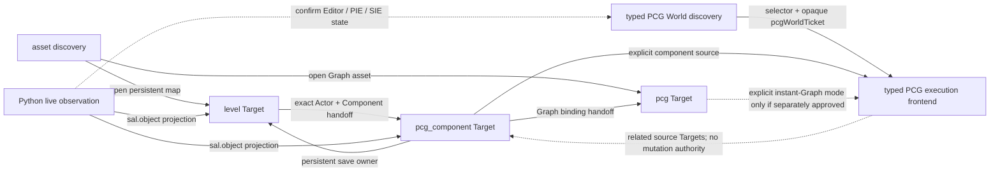

# Scene and PCG Domain Family

## Status

This document is the joint architecture overview for four related semantic
owners:

- `level`;
- `pcg`;
- `pcg_component`;
- `pcg_execution`.

Generic live-World control and observation are intentionally outside this
Domain family. The existing `python` frontend owns explicit Editor/PIE/SIE
control, and its planned `sal.object()` helper lets a script submit selected
UObjects for read-only Bridge projection into already published SAL views.

None of the new surfaces described here is part of the latest externally
released Loomle interface catalog; that product catalog still has six SAL
Domains. The unpublished feature branch now contains a coordinated nine-Domain
Query-only release candidate for `level`, `pcg`, and `pcg_component`, including
all three new static cards and the nine-Domain offline `sal_schema` catalog.
Those are branch-internal RC artifacts, not an external publication. The
`pcg`-specific authored Graph contract remains in
[`PCG_DOMAIN_DESIGN.md`](PCG_DOMAIN_DESIGN.md); this document governs the
ownership and handoff boundaries around it.

The RC also contains Level Context/handoff code and hostile fixtures, including
PCG Component `map` fail-closed, exact 8 Ki/64 Ki budget, and stale
zero-declaration override cases. The current branch-local Query-only snapshot
passes the official UE 5.7 and UE 5.8 arm64 builds; Level Query 8/8,
coordinated PCG Query 7/7, and family Phase 0 2/2 on both engines; and packaged
end-to-end acceptance on both engines. Its nine-Domain offline `sal_schema`
catalog and all three new static cards are complete.

That evidence accepts the branch-internal Query-only RC; it does not publish
it. The final release-archive audit, Windows acceptance, and production
promotion have not run, and the externally released catalog remains the
six-Domain product described above.

The next coordinated public milestone is now frozen as publication of that
**Query-only nine-Domain release candidate** after its remaining distribution
gates pass.
`level`, `pcg`, and `pcg_component` then enter the public
catalog together, are admitted only by `QueryTarget`, and are rejected as
`PatchTarget` before Bridge dispatch. That milestone includes their static
cards, Editor Context/read-only navigation where specified, and packaged
Client/Bridge parity. Authored mutation, save, Python `sal.object()`
projection, and typed PCG execution are later capability releases and are not
publication gates for these three read-only cards.

The architecture decision is firmer than the wire design:

- persistent Level state is not the same thing as a live Editor/PIE/SIE World;
- live World control remains an explicit Python workflow rather than a SAL
  Domain;
- authored PCG Graph state, authored PCG Component state, and PCG execution
  state are different semantic owners;
- no owner gains another owner's mutation authority merely because the same
  UObject is reachable from both;
- cross-owner work uses SAL's existing Result Text `related` Target and
  `handoff` envelope; `handoff` is result-only metadata, not a Query/Patch
  request statement;
- asynchronous PCG execution does not become an authored SAL Patch and uses a
  typed PCG frontend on a shared asynchronous execution kernel.

The Query Target shapes and initial Query/Patch admission policy below are the
frozen contract for the coordinated read-only milestone. Mutation effect
encodings, save results, Python projection, and execution request shapes remain
**proposed later implementation release gates**, not landed protocol. In
particular, no public MCP tool name such as `sal_run` is chosen here.

## Decision

The family has three Target-backed SAL Domains and one typed execution owner:

| Semantic owner | Public model proposed here |
| --- | --- |
| `level` | persistent, asset-backed SAL Domain |
| `pcg` | persistent, asset-backed SAL Domain |
| `pcg_component` | persistent, Level-owned specialized SAL Domain |
| `pcg_execution` | ephemeral execution context returned by a typed PCG execution frontend on the shared async kernel; not a SAL Domain keyword or Target |

Calling all four entries semantic owners does not mean that all four enter the
existing `Target.domain` enum. Adding
`pcg_execution` to that enum would falsely imply that ordinary
`sal_query`/`sal_patch`, request-local StableRefs, and authored mutation
semantics are sufficient for a long-running execution lifecycle.

Python is a frontend, not a fifth owner of serialized scene state. It may
control or observe live native state, but any persistent SAL identity returned
from `sal.object()` is generated by the Bridge's registered Domain projectors
and is revalidated by the later SAL request.

## Why Persistent Level And Live World Control Are Separate

A Level asset and a World instance sometimes expose the same Actors, but they
do not have the same identity, lifetime, or mutation rules.

The persistent side is anchored by one top-level source `UWorld` asset and its
authored closure: the source World's `PersistentLevel`, top-level Actors, and
World Partition external Actor packages. It does not silently absorb streaming
sublevels or the instantiated contents of a Level Instance. It survives Editor
restart, map close/reopen, PIE startup, streaming changes, and live UObject
replacement. It is the authority for:

- authored Actor and Component identity;
- serialized Actor lifecycle and common properties;
- package dirty state, source control, and save;
- World Partition ownership of external Actor packages.

The transient side is one live World instance in one Editor runtime epoch. A
map can simultaneously have an Editor World and one or more PIE, Simulate,
preview, or duplicated instances. Their pointers, live Actor objects,
selection, viewport state, loaded cells, and generated PCG objects disappear
or are replaced without changing the Level asset identity.

Conflating the two produces unsafe contracts:

- a live Actor object path can be mistaken for durable authored identity;
- a PIE duplicate can be mutated when the caller intended the Editor Level;
- a selection or camera operation can be reported as an authored edit;
- saving can target the wrong package or all dirty packages;
- a cached UObject can survive in the protocol after map load or Editor
  restart has invalidated it.

The separation therefore follows this rule:

> `level` answers “what serialized Level state is this and who may persist
> it?” Python answers “what live Editor operation should run now and what
> native state did it observe?”

When a Python result wraps a UObject with `sal.object()`, the Bridge may prove
that the observed object is itself persistent or uniquely maps to a persistent
authored source. The resulting projection is a standalone SAL view, not a
session Target, live-object lease, handoff from a hidden main Target, or
authority merge.

## Ownership Matrix

| Owner | Lifetime and anchor | Owns | Explicitly does not own | Authored Patch | Save authority |
| --- | --- | --- | --- | --- | --- |
| `level` | persistent `UWorld` asset and its Level-owned packages | Actor lifecycle; Actor Guid identity; labels, tags, folders, attachment, transforms, and serialized visibility flags; generic Component containment and common fields; Level/World Partition package ownership | PCG Graph topology; PCG-specific Component configuration; selection, camera, transient viewport visibility, PIE objects; PCG generation and inspection | no in the Query-only release; later only after a coordinated protocol/capability bump | no in the Query-only release; later for an exact Level-owned package plan |
| `pcg` | persistent top-level `UPCGGraph` asset | Nodes, Settings interface, Pins, Edges, Graph Parameters, authored layout and Graph package | Actors, `UPCGComponent`, instance overrides, generation, Data View, live World state | no in the Query-only release; later only after a coordinated protocol/capability bump | no in the Query-only release; later for the Graph package only |
| `pcg_component` | persistent original `UPCGComponent` reached through exact Level Actor identity | Graph binding; serialized PCG-specific Component configuration; Graph instance Parameter overrides; exact Component schema | Component creation/removal/rename/attachment; common Actor/Component fields; Graph contents; execution, generated output, save | no in the Query-only release; later only after an edit guard and coordinated protocol/capability bump | no; hand off to `level` after a future mutation |
| `pcg_execution` | ephemeral execution id bound to one admitted private World epoch and source | typed PCG World discovery, admission, generate, continuation/poll, cancellation, component-scoped cleanup, messages, inspection, bounded Data View, and before/after resource attribution on the shared async lifecycle | authored Graph/Level/Component mutation; generic World control; save; durable StableRefs; ownership of every resource observed after a run; implicit authority over source Targets | not a SAL Patch | never |

The explicit Python control/observation plane has no authored Patch or save
authority. Its mutations follow the Python fallback's non-transactional and
partial-effect rules. `sal.object()` adds read-only projection only; it does
not make Python transactional or give a live UObject a durable identity.

“Derived” does not mean “unimportant.” Generated Actors, data, messages, cache
invalidations, and cleanup results must be reported and verified. It means
they are not serialized authored state and are not covered by an authored
package transaction or save.

## Proposed Targets And Identity

Every shape in this section requires parser, resolver, formatter, native
identity, reload, and corruption tests before publication.

### Level

Proposed canonical exact Target:

```sal
l = target {
  domain: level,
  asset: "/Game/Maps/Forest.Forest",
  type: "/Script/Engine.World"
}
```

`asset` is the exact top-level `UWorld` object path. `type` verifies the actual
loaded Class and never selects the Domain.

Proposed persistent identity environment:

| Object | Target-relative identity |
| --- | --- |
| Actor | native persistent `ActorGuid` |
| Component | owning `ActorGuid` plus source kind and source-specific persistent slot id |

Illustrative StableRefs are therefore:

```sal
@11111111-1111-1111-1111-111111111111
@11111111-1111-1111-1111-111111111111/native/PCGComponent
@11111111-1111-1111-1111-111111111111/scs/"/Game/Actors/BP_Forest.BP_Forest_C#22222222-2222-2222-2222-222222222222"
```

Actor Guid persistence, duplicate detection, Level Instance scoping, and
Component source mapping across construction reruns are release gates. Native
default-subobject and serialized instance Components use their actor-scoped
`FName` as a durable slot id. SCS Components use a qualified
`OwnerGeneratedClassPath + VariableGuid` id. UCS products have no persistent
Component identity in the first release and remain transient-only. A live
UObject path, Actor label, outliner position, selection index, or pointer is
never persistent identity.

### PCG Graph

The proposed Target remains the one defined by the authored PCG design:

```sal
g = target {
  domain: pcg,
  asset: "/Game/PCG/PCG_Forest.PCG_Forest",
  type: "/Script/PCG.PCGGraph"
}
```

Node `FName`, Pin direction plus Label, and Graph Parameter descriptor Guid are
relative to this exact Graph. They do not identify a World instance or a
Component override.

### PCG Component

Proposed canonical exact Target:

```sal
c = target {
  domain: pcg_component,
  asset: "/Game/Maps/Forest.Forest",
  actorId: "11111111-1111-1111-1111-111111111111",
  source: "native",
  id: "PCGComponent",
  type: "/Script/PCG.PCGComponent"
}
```

The Target is flat:

- `asset` verifies the persistent owning Level;
- `actorId` is the native persistent Actor Guid;
- `source` is `native`, `scs`, or `instance` and selects the native locator
  family;
- `id` is the actor-scoped `FName` slot for `native`/`instance`, or the
  qualified generated-Class/SCS VariableGuid key for `scs`;
- `type` verifies the actual Component Class.

An object path is explicitly rejected as persistent Component identity. A
runtime duplicate, generated Component, preview Component, or PIE Component
cannot be canonicalized into this Target merely because its object path looks
similar.

The resolver must find the original serialized Component through the Level,
Actor, and source-aware locator, audit collisions, and verify native ownership
before returning an exact Target. For `native` and `instance`, identity denotes
the durable serialized slot rather than one UObject incarnation; delete and
same-slot recreation across reload cannot be distinguished and is not claimed
as replacement detection. Runtime incarnation identity stays private to the
Python call or typed PCG execution record. Graph Parameter overrides may use
their native descriptor Guid
inside this Component Target, but they remain instance override state and
never alias the Graph default Parameter in `pcg`.

### Python Live Observation And `sal.object()`

No transient World becomes a SAL Target. Python reacquires the required
Editor, PIE, or SIE World inside each short call and returns ordinary structured
facts. When selected UObjects should be connected to the structured interface,
the script marks them explicitly:

```python
def run():
    actor = ...
    component = ...
    return {
        "mode": "sie",
        "actor": sal.object(actor),
        "component": sal.object(component),
    }
```

`sal.object(value)` is an execution-local projection request, not a serializer
or assertion that the object has SAL identity. At terminalization the Bridge
uses registered read-only projectors. The wire model has two separate axes:

- `status = projected | unsupported | ambiguous | stale | failed` describes
  whether projection completed and produced views;
- a successful view has `relation = exact | authored_source`, where `exact`
  identifies the observed UObject itself and `authored_source` identifies a
  uniquely proven persistent source for a live duplicate.

A transient-only object is `status: unsupported` with a diagnostic reason such
as `projection.transient_only`; `transient` is not another status. Projector or
Bridge integrity faults use `failed`, set the annex `complete` flag to false,
and never return an invalid Target. Only `projected` records contain canonical
views. One UObject may produce several independent Domain views; the Bridge does not pick
one merely from native Class. Projection never loads a map or asset, changes
selection, dirties state, or retains the UObject after the terminal result is
formed.

### PCG Execution

`pcg_execution` has no proposed SAL Target. A successful start request returns
an opaque execution id bound to:

- one Bridge-private live World epoch selected and revalidated by the typed
  PCG frontend;
- one exact authored source Target and source identity snapshot;
- one execution mode and option set;
- before/after managed-resource snapshots and an explicit completeness claim.

The execution id is not a StableRef, asset path, UObject path, or authority
token for the source. World loss removes every live-control use: unfinished
work becomes a retained `lost` record, while an already-terminal record remains
read-only evidence for its bounded retention. The id becomes unusable after
record expiry, explicit release, or owning-runtime loss. A resource observed
after generation is not automatically owned by that execution; PCG
managed-resource lifecycle is Component-scoped and may include reused or
previously generated state.

## Target, Projection, And Execution Graph



The arrows mean navigation or explicit input, not nested Target ownership.
Where both ends are SAL Targets, the result uses the existing Result Text
`related` Target and `handoff` envelope:

```sal
related levelTarget = target {
  domain: level,
  asset: "/Game/Maps/Forest.Forest",
  type: "/Script/Engine.World"
}
handoff save to levelTarget
```

`handoff` is emitted by a result adapter. It is not legal as a Query or Patch
statement and does not execute `save`; it preserves an exact related Target
and purpose for a later independent request. The alias is local to that Result
Text, so the caller resubmits the canonical Target rather than carrying the
alias across requests.

A Python result has no one active SAL Target, so each successful
`sal.object()` view is returned as an independent normalized exact Query
result, not as a fabricated handoff table. A later `sal_query`, `sal_schema`, or
`sal_patch` is a new request and re-resolves the projected Target.

A typed PCG live operation accepts one canonical source Target plus an exact
typed-PCG World selector and opaque `pcgWorldTicket`. The ticket binds a
Bridge-private World epoch and is a short-lived freshness precondition for
typed-PCG prepare follow-ups, generation, cleanup, and prepared live
observation. It is not a Target, StableRef, generic live handle, or mutation
authority; every request independently validates the selector, source,
client/runtime, permissions, and operation.

## Domain Contracts

### `level`

`level` owns persistent scene authorship. Its eventual Query surface may
include summary, Actors, exact Actor and Component reads, attachment and folder
relationships, World Partition descriptors, contextual Palette, and exact
schema. Its eventual Patch can reuse existing SAL statements for Palette-backed
Actor or Component creation, `set`, `reset`, exact-schema compound transform
operations, attachment operations, and `remove`. Core `move` remains a 2D
layout/reordering statement and does not represent an Actor transform.

The following ownership rules are mandatory:

- Actor creation and deletion belong to `level`, including creation of an
  Actor that happens to contain a PCG Component.
- Generic Component containment belongs to `level`; `pcg_component` begins
  only after an original PCG Component exists and is rediscovered by persistent
  identity.
- Common transform, attachment, folder, label, and tag changes remain in
  `level` even for an `APCGVolume` or an Actor with a PCG Component.
- Construction reruns and Blueprint-created runtime Components are native
  lifecycle boundaries. The adapter must re-resolve persistent identity and
  report authored and derived cascades separately.
- A Level Target never silently chooses the current Editor World or a PIE
  World by pointer identity.

### `pcg`

`pcg` owns one asset-backed Graph's authored model. Its Target, StableRefs,
Query, Palette, connection capability, read-only Graph Parameter boundary,
transaction, and terminal save design are defined in
`PCG_DOMAIN_DESIGN.md`.

This family adds these constraints:

- Graph edits never mutate a bound Component's overrides.
- Graph edits may report derived invalidation of dependent Components, but do
  not generate, cleanup, or inspect them.
- A Graph default Parameter and a Component override are independent authored
  values with separate Targets and identities.
- A Graph save writes only the Graph's outermost package.
- A Graph result may hand off factual bound Components only when Loomle can
  produce their exact persistent `pcg_component` Targets.

### `pcg_component`

`pcg_component` owns only the original serialized Component's PCG-specific
surface. Exact instance schema decides which native fields are readable,
writable, resettable, or invokable on the supported engine version.

Its implemented RC Query surface remains intentionally narrower than
that eventual surface. Slice 1C-B-A exposes canonical resolution, `target`,
`summary`, exact schema, bounded zero-load direct/top Graph-binding facts, and
fixed `inspect_level` / conditional `inspect_graph` navigation. Slice 1C-B-B
adds bounded Graph Parameter enumeration, exact descriptor-Guid StableRefs,
override-source proof, and lossless certified scalar readback. The
Level-to-specialized direction uses the fixed `inspect_pcg_component` purpose.
No Query-only result emits `save`.

For an SCS-backed Component, this Target may eventually write only a value
that UE truly serializes as an override on this exact placed Actor instance.
Template/default-owned Graph binding or configuration remains read-only here
and returns the exact Blueprint/Class handoff. The specialized Level-owned
Target never writes through to an SCS node, component template, Class Default
Object, or Blueprint asset.

Expected responsibilities include once the authored edit guard described in
`PCG_RUNTIME_DOMAIN_DESIGN.md` is proven:

- read and change the Graph binding without editing the Graph;
- read, set, and reset Graph instance Parameter overrides by native Parameter
  descriptor identity;
- read and change supported serialized PCG Component configuration;
- report Graph-instance reconstruction and cache invalidation;
- return the related `pcg` Target for an independent asset-backed Graph;
- return the owning `level` Target and a save handoff after authored changes.

It does not create or remove the Component. It does not rename or reattach it,
change the Actor transform, edit the Graph, execute generation, cleanup
generated output, select the Actor, or save a package.

Changing a Graph binding or override may synchronously replace native Graph
instance objects. Statements after that boundary re-resolve the original
Component and current override descriptors. A pre-call pointer to a Graph
instance is never retained as identity.

Until the adapter can prove that native refresh and notification paths do not
start an asynchronous generate or cleanup task inside the transaction,
`pcg_component` is Query-only. A non-transactional execution request is not a
substitute for authored override mutation.

### Python Live Control And Projection

Starting or stopping PIE or SIE, possess/eject, selection, camera focus,
streaming/loading, session-only visibility, and other transient Editor controls
use the existing explicit `python` fallback under its permission, short-call,
state-reacquisition, and partial-effect rules. Python returns before
asynchronous play-state transitions can advance; later calls confirm native
state and reacquire every World and UObject.

The planned `sal.object()` helper improves the return path without changing
that ownership. It lets Python explicitly mark individual UObjects, after which
the Bridge may return canonical persistent `level`, `pcg`,
`pcg_component`, or other already published SAL views. A live duplicate is
never itself formatted as a persistent Target: only a uniquely proven authored
source may appear in a `projected` record whose view has
`relation: authored_source`.

Generic transient facts remain ordinary Python-result JSON. PIE/SIE Worlds,
runtime-created objects, viewport state, selection, World contexts, native PCG
tasks, and generated resources do not acquire SAL identity merely because a
script passes them to `sal.object()`. No SAL Domain silently invokes Python on
the caller's behalf.

#### `sal.object()` projection slice plan (branch, not published)

The runner script injects a `sal` namespace into the execution. `sal.object(v)`
requires a Unreal Engine object (an object with `get_path_name`); it returns
the reserved marker

```python
{"__loomle_sal_object__": "<native object path>"}
```

which is JSON-safe and survives the runner result document. The reserved key
is closed; a user dict containing it is rejected by the runner validator.

At terminalization the Bridge walks the result JSON on the Game Thread,
replaces every marker in place with an independent normalized projection
record, and reports the projection set annex:

```json
{"projection": {"complete": true, "marked": 2, "projected": 2}}
```

`complete` is false when any projector or Bridge integrity fault occurred.
The annex never fabricates Object Text and is omitted when the script marked
nothing. A projection record is one of:

- `{"status": "projected", "relation": "exact", "view": <canonical SAL exact
  Query result>}` — the observed UObject itself is a persistent SAL subject;
- `{"status": "projected", "relation": "authored_source", "view": <canonical
  SAL exact Query result>}` — the observed UObject is a uniquely proven live
  duplicate whose view is of the authored source;
- `{"status": "unsupported", "diagnostics": [...]}` — a transient-only object
  with no proven authored source reports `projection.transient_only`;
- `{"status": "stale", "diagnostics": [...]}` — the marked object no longer
  resolves at terminalization;
- `{"status": "ambiguous", "diagnostics": [...]}` — no unique authored source
  or SAL subject can be proven;
- `{"status": "failed", "diagnostics": [...]}` — projector or Bridge
  integrity fault; the annex `complete` flag is false.

The `view` is produced by the same Domain adapters as ordinary SAL Queries
(one canonical exact Query result per Domain view), so projection reuses the
tested Target/schema/read paths and never invents a new serialization. A
single UObject may produce several independent Domain views (for example an
`asset` view and a `pcg` view for a Graph asset); the Bridge does not pick one
merely from native Class. Projection never loads a map or asset, changes
selection, dirties state, or retains the UObject after the terminal result is
formed.

Certified Domain views in this increment: `level` exact Actor and exact
serialized Component for persistent source-map subjects; `asset` exact for
asset-backed subjects; `class` exact for native Classes; `blueprint` exact for
Blueprint assets; `pcg` exact Target for top-level Graph assets;
`pcg_component` exact for original serialized Components on a persistent
source map. A PIE/SIE Actor or Component duplicate projects
`relation: authored_source` only when its ActorGuid matches a persistent
source-map Actor; otherwise it is `unsupported` with
`projection.transient_only`.

### `pcg_execution`

`pcg_execution` owns typed PCG facts on the shared asynchronous execution
lifecycle. The common outer envelope reuses the proven Python status and
continuation model:

```text
running -> succeeded | failed | lost
```

The typed PCG result separately records admission, queued/running native work,
`Completed`/`Aborted`, cancellation-request, resource, and inspection facts.
Cancellation does not invent a generic outer `cancelled` status before native
terminal observation. Component-scoped cleanup starts another typed PCG
operation; it is not a state transition that claims one earlier execution
owned all resources. Exact native-to-public outcome mapping remains a release
gate. The frontend must support, where native APIs make them truthful:

- explicit admission against an exact typed-PCG World selector, matching
  ticket, and authored source;
- generation or an explicitly distinct supported mode;
- shared continuation/poll plus typed PCG progress and native-status facts;
- cooperative cancellation;
- explicit Component-scoped cleanup with a reported before/after resource
  scope;
- execution messages and severity;
- inspection and bounded Data View reads;
- terminal lost-World and cleanup outcomes.

Execution does not receive mutation authority over its source Targets. Native
generation may materialize managed Actors, Components, data, or cache state.
The execution record correlates observed effects but does not claim exclusive
ownership merely because they appeared after admission. Cleanup uses the
source Component's native managed-resource lifecycle and can be broader than
one earlier run; its exact Component-wide scope must be explicit. It cannot
delete an authored source Actor, original PCG Component, PCG Graph, or
resources managed by another source Component.

Graphs with unbounded external side effects, asset writes, or outputs that
cannot be attributed to one execution remain unavailable until their effects
and cleanup are source-grounded.

## Authored And Derived Effects

The family requires an explicit semantic distinction between stored state and
recomputable or live state.

An authored effect changes the declared serialized source of truth owned by a
Level, Graph, or Component Domain. A derived effect is live, cached, generated,
inspection, or presentation state whose lifecycle remains native-derived.
Derived PCG projections may still occupy a Level/external package or change a
package dirty flag; physical serialization does not silently promote them into
Level-authored identity. Those persistence-owner changes are reported
separately and never justify an automatic save.

Direct versus cascade and authored versus derived are independent axes. For
example, a PCG Settings edit is direct authored state; native Pin rebuild may
remove serialized Edges as cascade authored effects; cache invalidation caused
by the same edit is a derived effect.

| Operation | Authored direct effects | Authored cascade effects | Derived effects |
| --- | --- | --- | --- |
| Level Actor spawn | Actor and requested serialized fields | native serialized Components or attachment changes that are part of creation | construction rerun, editor visualization, live handle creation |
| PCG Settings edit | exact Settings field | Pin/Edge reconstruction and downstream stored topology changes | Graph/editor cache invalidation; dependent Component invalidation |
| Component Graph binding | serialized binding and requested overrides | reset or remap of serialized overrides when native semantics require it | Graph instance replacement; generated-data invalidation |
| Explicit Python selection or camera control | none | none | selection, focus, camera and visibility postconditions observed outside SAL |
| PCG generate | none | none | generated data/Actors/Components, messages, inspection state |
| Save | native `PreSave` synchronization, if any, discovered by pre/post snapshot | engine-specific pre-save normalization | persistence barrier, dirty-state and source-control outcome |

Mutation metadata must preserve the distinction with a closed effect class or
equivalent structured field. This is a protocol result-shape release gate, not
a reason to invent a second Object Text syntax.

Rules:

- every certified authored cascade of an authored Patch is part of dry-run
  planning, live readback, Undo, and rollback; terminal persistence requests
  are excluded, and any live `PreSave` changes are reported only by pre/post
  snapshot and readback;
- derived invalidation may be reported by an authored Patch, but generation is
  never silently run to make the invalidation disappear;
- execution results never claim that UObject transaction rollback restored
  derived work that native execution already emitted;
- dirty state and saved state are persistence metadata, not authored object
  fields;
- an effect that cannot be classified or attributed fails closed before a
  public mutating capability is advertised.

## Transaction Boundaries

There is no cross-Domain transaction.

| Owner | Preflight and transaction contract |
| --- | --- |
| `level` | one isolated authored plan and one top-level transaction for one exact Level Patch; includes every certified serialized Actor/Component cascade in scope |
| `pcg` | one isolated Graph plan and one top-level transaction for one exact certified Graph Patch, as defined by the PCG design |
| `pcg_component` | one isolated original-Component plan and one top-level transaction for its exact certified PCG-specific authored fields and override cascades |
| `pcg_execution` | typed shared-kernel execution and non-transactional; cancel and cleanup are explicit PCG operations |

Python live control is also non-transactional and outside authored Patch.
`sal.object()` performs only terminal read-only projection and adds no rollback
or save semantics to the script that produced the candidate.

A `pcg_component` Patch may dirty a package owned by the Level, but that does
not turn the request into a Level Patch. The specialized adapter has authority
only over the closed PCG Component field surface. Actor containment and other
Level state remain unavailable in that transaction.

The family shares operation leases without sharing transactions. An active PCG
execution source blocks Level lifecycle/field mutation of its source Actor and
Component and blocks Level save for the affected closure. The result returns
the exact execution facts plus a typed PCG settle/cancel next-action suggestion,
not a SAL handoff; it never cancels implicitly. Conversely, Level mutation of
that source or Level save holds a lease that blocks new execution admission.
Every admitted nonterminal execution and Graph Patch/save use the corresponding
Graph lease, regardless of inspection capture. Retained inspection data must
be self-contained after terminal observation. These are fail-closed admission
rules, not distributed rollback.

After execution settles, Component-managed resources can still outlive the
execution record. Level removal/reconstruction of their source Actor or
Component fails closed while those resources remain or their inventory is
incomplete, and returns exact World/source facts plus a typed `pcg.cleanup`
next-action suggestion outside the SAL handoff table. Native destruction is
not allowed to hide cleanup inside an authored transaction.

A workflow may apply a Graph Patch, then a Component Patch, then a Level
Patch. Each successful request is independently committed. Failure of a later
request does not roll back an earlier request in another Domain. Results and
agent guidance must not imply distributed atomicity.

Dry-run applies only to authored mutation providers. It must not start PCG
generation, change session state, save packages, or create persistent Undo
entries.

## Save Boundaries

Persistence follows the native owner rather than the object currently in
hand:

- `pcg save` writes only the exact Graph Target's outermost package;
- `level` owns persistence of the enumerated Level-owned dirty closure: its map
  package and exact World Partition external Actor packages;
- `pcg_component` never saves and returns an explicit `level` handoff;
- Python live control and `pcg_execution` never save implicitly;
- no authored Patch or execution request implies save;
- no family operation calls a broad “save all dirty packages” fallback.

Save remains a terminal persistence barrier, independent from the preceding
authored UObject transaction. Save failure retains dirty in-memory authored
state and exact Target context; it does not claim rollback of a previously
successful Patch.

World Partition makes the exact Level save unit a release gate. Before Level
save is published, the adapter must:

1. resolve each package from persistent authored identity;
2. distinguish the map package from external Actor packages;
3. expose the exact package plan before I/O;
4. perform source-control and read-only checks on that exact plan;
5. reject rather than save any dirty package outside the Level-owned closure;
6. report partial native save outcomes without fabricating atomic disk I/O.

Level `save` persists the current owned dirty closure, not a caller-selected
Actor package and not only the effects of the immediately preceding Patch. It
may therefore persist pre-existing user edits in an owned package; the plan
must disclose that fact before I/O.

That package-level contract cannot selectively omit a generated PCG Actor or
Component that lives in an otherwise valid map/external-Actor package. The
joint baseline therefore adds a derived-state save guard: if a registered PCG
provider proves that managed generated projections are present in the owned
dirty closure, or cannot inventory them completely, Level save fails closed
before checkout/`PreSave`/I/O. It returns the managing Component/World facts
and a typed PCG cleanup next-action suggestion where the exact inputs are
known. That suggestion is ordinary result data, not a SAL Target handoff.
Cleanup is never automatic. Persisting generated output requires a future
explicit bake/adopt authoring contract; it is not ordinary Level save.

## What Existing SAL Can Express

After the new Target-backed Domain keywords and field schemas are added, the
current SAL language can express most authored and navigation work without a
new statement grammar.

| Capability | Existing SAL shape | Core syntax change? |
| --- | --- | --- |
| exact Level, PCG, or PCG Component selection | flat `target { domain: ..., ... }` | no new Target syntax; Domain enum and closed fields must expand |
| exact Actor, Component, Node, Pin, or Parameter access | Target-relative StableRef and member path | no |
| collection, topology, context, and exact schema reads | ordinary Query primary operations and `with schema` | no |
| Actor/Component or PCG Node creation | Palette binding plus `add` | no |
| authored field and override mutation | `set`, `reset`, `move`, `invoke`, `remove` | no |
| PCG topology mutation | Domain `connect`, `disconnect`, and `break` | already supported as Domain extensions |
| cross-owner navigation | existing result-only `related` Targets and explicit `handoff` envelope | no |
| authored validation and planning | `patch <target> dry run` | no |
| Graph and exact Level persistence | terminal `save` or an exact-schema operation when required | no grammar change, but Level save semantics are a release gate |
| Editor, PIE, or SIE control | explicit existing `python` fallback followed by state readback | outside SAL; no new transient-control request |
| selected Python UObject projection | `sal.object()` marker plus Bridge-owned independent SAL exact Query results | outside Query/Patch; Python output schema expands, SAL statement grammar does not |
| asynchronous PCG execution | typed PCG frontend on the shared async execution kernel | outside Query/Patch; no SAL statement grammar |
| authored/derived effect classification | mutation result metadata | no SAL text syntax; normalized result schema must expand |

This is “zero new statement grammar,” not “zero protocol work.” Three protocol
distinctions are important.

First, the Domain catalog is a closed enum. Adding `level`, `pcg`, and
`pcg_component` makes them structural keywords accepted
in `Target.domain` and reserved against ambiguous use as local aliases,
semantic tags, or unquoted Names. For example, `levelTarget` remains a legal
alias while bare `level` becomes reserved. Parser, normalized schema,
formatter, and Bridge must change together.

Second, every Target variant has a closed field set:

```text
level          = domain, asset, type
pcg            = domain, asset, type
pcg_component  = domain, asset, actorId, source, id, type
```

Missing required fields, unknown fields, nested Targets, arrays, or aliases in
Target fields are rejected. Closing the shape makes canonical comparison,
deduplication, routing, authorization, and stale/corrupt Target diagnostics
deterministic.

Third, Query and Patch have different Target admissibility even though they
reuse the same Target syntax. The initial family policy is:

| Target | Query | Authored Patch |
| --- | --- | --- |
| `level` | yes | no in the coordinated Query-only release |
| `pcg` | yes | no in the coordinated Query-only release |
| `pcg_component` | yes | no in the coordinated Query-only release |

The normalized protocol represents that distinction as separate
`QueryTarget`/`PatchTarget` unions or equivalent pre-dispatch validation. All
three new Target variants are absent from the initial `PatchTarget` set, so a
Patch fails before Bridge Domain dispatch. Enabling any later `level`, `pcg`,
or `pcg_component` authored Patch requires a coordinated protocol/capability
bump even if the SAL statement spelling itself is unchanged. This distinction
does not create a multi-Target request.

The word “union” here means a type union of legal Target shapes, not a
multi-Domain transaction. SAL keeps its existing invariant: one Query or Patch
has one active Target and one active Domain. A result may return independent
related Targets and result-only handoffs, and the agent may orchestrate later
requests, but no request gains joint mutation authority or cross-Domain
rollback. True multi-Target mutation, such as future Graph-Parameter migration
across loaded GraphInstances, remains a separate deferred protocol problem.

## Typed PCG Execution On The Shared Async Kernel

The current Query/Patch model deliberately has one active Target, request-local
aliases, synchronous completion, and authored mutation semantics. A truthful
PCG execution start needs two independent inputs:

- an exact typed-PCG World selector plus opaque `pcgWorldTicket` proving the
  Bridge-private World epoch observed during discovery;
- the exact authored `pcg_component` source, or a separately approved explicit
  PCG Graph instant-execution source.

The source Target supplies persistent identity. The selector and ticket supply
only a short-lived freshness precondition for one typed-PCG live operation.
Neither contains the other, and the ticket is never accepted by SAL. Prepare
accepts selector plus source and issues the ticket; generation, cleanup, and
prepared observation resubmit selector plus ticket plus that same source.
Poll, cancel, inspection, and retained-data reads instead use only the admitted
execution id.

It then produces an execution context that must survive across requests for
poll, cancellation, and retained inspection. Component-scoped cleanup instead
uses the exact World/source to admit a new typed operation and new async
record; an old execution id may be evidence but never cleanup authority. A
local `invoke ... as alias` output cannot support either lifecycle because
local aliases do not survive the request. Treating the handle as a StableRef
would falsely make an ephemeral execution look like durable Target-relative
identity. Treating generation as Patch would falsely promise dry-run, Undo,
save, and atomic rollback.

Loomle already has a proven asynchronous envelope in the `python` tool:
`running`, `succeeded`, `failed`, or `lost`; opaque `executionId`; exact
continuation/poll; bounded retained results; runtime affinity; and conservative
`stateMayHaveChanged` recovery. PCG should reuse that shared lifecycle kernel
instead of inventing an unrelated polling protocol. It does not execute PCG
through Python: a typed PCG adapter owns native scheduling, leases, messages,
effects, cancellation, cleanup, and inspection.

The architectural split is:

| Layer | Shared responsibility | PCG-specific responsibility |
| --- | --- | --- |
| async kernel/envelope | execution record, outer status, continuation, poll, retention/expiry, runtime loss, no automatic replay, uncertainty | none |
| typed PCG frontend | exact operation schema and capability discovery | private World-epoch/ticket validation, source validation, native task scheduling, Graph/Level/Component leases, effects, cancel, cleanup, messages, Data View |
| Python frontend | keeps its current `run`/`poll` lifecycle | script staging, safe Game-Thread entry, logs, traceback, explicit live control, and `sal.object()` candidate registration |

The two frontends use namespaced ids and adapter-specific result payloads; an
id never crosses frontend ownership or becomes a SAL StableRef. Python keeps
its current rule that a fast terminal `run` does not expose an id. PCG always
exposes the admitted execution id, including on fast terminal success, because
bounded messages/effects/inspection may need retained follow-up. That typed
frontend difference does not alter the common lifecycle. Adding
`sal.object()` is a separate coordinated Python output-schema extension;
extracting the shared kernel must preserve both ordinary legacy Python results
and the complete regression suite.

An illustrative, non-contract typed PCG start shape is:

```json
{
  "operation": "start",
  "kind": "pcg.generate",
  "world": {
    "selector": { "worldKind": "editor" },
    "pcgWorldTicket": "<opaque-short-lived-ticket>"
  },
  "sourceTarget": "target { domain: pcg_component, asset: \"/Game/Maps/Forest.Forest\", actorId: \"...\", source: \"native\", id: \"PCGComponent\", type: \"/Script/PCG.PCGComponent\" }",
  "options": {}
}
```

If it outlives the inline completion window, the common outer result is shaped
like:

```json
{
  "status": "running",
  "executionId": "pcg_...",
  "stateMayHaveChanged": true,
  "continuation": {
    "tool": "<typed-pcg-tool>",
    "arguments": { "operation": "poll", "executionId": "pcg_..." },
    "pollAfterMs": 250
  }
}
```

The exact continuation is followed without replaying `start`. Typed operations
then cover:

```text
start pcg.generate
poll the returned execution
request cancellation of that exact current source operation
inspect retained messages or data
start pcg.cleanup against the exact Component source
```

Cleanup is a new Component-scoped typed operation and its own async record. It
does not delete a resource list allegedly owned by an earlier execution.

The public MCP tool name, private RPC route, typed PCG input/result fields,
native-outcome mapping, cancellation deadline, inspection pagination, and
instant-Graph mode remain protocol release gates. The common outer statuses,
continuation discipline, runtime-loss behavior, and no-replay rule should stay
aligned with the existing Python lifecycle.

The PCG frontend must additionally define:

- admission versus completion;
- mapping of queued/running/native `Completed` or `Aborted` facts into the
  shared outer result without inventing native outcomes;
- idempotency of poll, cancel request, inspection, and cleanup admission;
- typed derived-effect completeness in addition to common
  `stateMayHaveChanged` uncertainty;
- runtime/World replacement behavior;
- bounded results and continuation cursors;
- concurrency and inspection locks for Components sharing a Graph;
- recovery after timeout, Editor shutdown, disconnect, or lost callback;
- source identity readback without granting mutation authority.

The typed PCG frontend must not silently execute through Unreal Python or UE's
experimental MCP PCGToolset. Python remains the explicit Editor-control
fallback, not the implementation of structured PCG execution.

## Dependency And Publication Order

The family should land internally in this dependency order:

1. **Phase 0 — minimal shared Target groundwork**: historically added the
   three closed Target variants, separated Query, canonical Result/related-
   Target, and Patch admission, moved StableRef identity validation into
   Domain adapters, and added parser/formatter/schema plus Client/Bridge
   fail-closed fixtures. Bridge resolution and dispatch could land as explicit
   unavailable stubs. At its original landing Phase 0 did not add effect
   classification, save-plan
   support, `sal.object()` projection, mutation, persistence, an interface
   card, or a public catalog promise.
2. **`level` persistent identity and read-only Query**: Actor Guid,
   source-aware Component locator audit, World Partition descriptors, and
   persistent handoffs.
3. **`pcg` Graph identity and read-only Query**: enough independently
   specified Graph Target semantics to validate factual Graph navigation.
4. **`pcg_component` binding Query**: canonical `target`/`summary`, bounded
   zero-load Graph-interface traversal, and Level/Graph handoffs; depends on
   Level Actor/Component identity and PCG Graph Target semantics.
5. **`pcg_component` Parameter Query**: descriptor-Guid alignment, lossless
   value encoding, and effective override-source proof; remains separate from
   Component mutation research.
6. **coordinated Query-only catalog RC — implemented and accepted in the branch**:
   branch source now contains Level Editor Context, read-only related
   Target/handoff coverage, all three cards, the nine-Domain offline schema
   catalog, hostile fixtures, and all three Targets excluded from `PatchTarget`.
   Official UE 5.7 and UE 5.8 arm64 builds pass; Level Query passes 8/8,
   coordinated PCG Query passes 7/7, and family Phase 0 passes 2/2 on both
   engines; and packaged end-to-end acceptance passes on both engines. External
   publication still requires the final release-archive audit, Windows
   acceptance, and production promotion.
7. **`level` and `pcg` authored mutation and exact save — implemented in the
   branch**: each follows its independent protocol/capability bump,
   transaction, persistence, failure-injection, and 5.7/5.8 gates. `level`
   ships set/reset, the compound Actor transform, Palette-backed Actor and
   instance Component lifecycle, and the terminal map save (PCG derived-state
   guard; World Partition closure still a release gate). `pcg` ships
   Palette-backed Node creation, removal, edge connect/disconnect, Settings
   set/reset, absolute move, and the terminal Graph package save.
8. **Python `sal.object()` projection — implemented in the branch**: the
   runner injects a `sal` namespace; markers are replaced in place at
   terminalization by canonical views from the same Domain adapters, with the
   projection annex and the projection.* diagnostic layer. Editor/PIE/SIE
   control remains explicit Python outside SAL.
9. **shared async-kernel extraction and typed PCG execution frontend —
   implemented in the branch (first sub-slice)**: `FLoomleAsyncKernel` owns
   the frontend-neutral lifecycle (extracted from the Python fallback without
   changing its behavior); `FTypedPcgWorldRegistry` owns normalized selectors,
   World epochs, and source-bound tickets; `FTypedPcgExecutionCoordinator`
   admits one Editor-World generate per validated selector + ticket + source,
   captures the lossless native task id, and observes terminal generation.
   PIE parity, leases, cancellation, cleanup, derived-effect ownership, and
   inspection remain later sub-slices.
10. **`pcg_component` authored edit guard — implemented in the branch**:
    the canonical Target enters `PatchTarget` and `FSalPCGComponentInterface`
    applies certified scalar edits (Seed set/reset) inside one transaction
    gated by the fail-closed async edit guard (idle before and after, rollback
    if a native notification starts an asynchronous PCG task); a terminal
    save is a level-owned no-op. Parameter override mutation and Graph
    assignment remain later increments.

Read-only `level` and `pcg` implementation can proceed in parallel, but
`pcg_component` must not invent temporary identity while waiting for either
Target contract. The coordinated Query-only publication precedes every new
family mutation, projection, and execution capability. Their authored
mutation/save slices remain independent of the Query-only Component adapter.
Execution is last because it composes the already verified boundaries without
merging them.

The family uses UE's built-in PCG plugin as an always-on production
dependency. `LoomleBridge` and `LoomleBridgeTests` compile against the public
`PCG` runtime module, and the plugin descriptor enables `PCG`. Neither module
depends on `PCGEditor`; editor-only and experimental PCG tooling remains source
reference material rather than a Loomle runtime dependency.

Internal slices are not separate public catalog promises. Query-only `level`,
`pcg`, and `pcg_component` enter one coordinated nine-Domain SAL catalog
release after their shared Target/schema/Client/Bridge and packaged Query gates
pass. Mutation/save, the Python `sal.object()` annex, and the typed PCG
frontend are separately versioned capability releases.

No Domain is published merely because a later Domain needs it. Each slice
must pass its own static card, native automation, Client/Bridge parity, and
packaged acceptance gates.

## Protocol And Catalog Impact

If the three Target-backed Domains ship together, the current six-Domain SAL
catalog becomes a nine-Domain catalog:

```text
asset, blueprint, class, graph, state_tree, widget,
level, pcg, pcg_component
```

`pcg_execution` is not added to that list.

The internal Target groundwork allocated Client/Bridge protocol v6 on the
unpublished family feature branch. The current v6 wire contract includes:

- three new structural/reserved Domain keywords;
- closed Target fields and canonical formatter order:
  - `level`: `domain, asset, type`;
  - `pcg`: `domain, asset, type`;
  - `pcg_component`: `domain, asset, actorId, source, id, type`;
- normalized JSON Schema and generated TypeScript Target-variant updates;
- distinct Query/Patch Target-admissibility sets or equivalent validation so
  `level`, `pcg`, and `pcg_component` are legal for Query but rejected as Patch
  Targets before Bridge dispatch; publishing any later authored Patch support
  requires a coordinated protocol/capability bump;
- parser, formatter, lowering, Bridge validation, and diagnostic parity;
- the normalized `actors` collection operation required by the first Level
  read-only slice;
- Result Target, related Target, scoped reference, and existing result-only
  handoff Target-variant updates; and
- protocol fixtures proving old/new Bridge mismatch fails closed.

The branch RC has already landed:

- three static `sal_schema` cards with offline availability;
- the branch-local nine-Domain catalog contract;
- Level Editor Context and the frozen read-only related Target/handoff paths;
  and
- Query-only exclusion of all three new Domains from `PatchTarget`.

The current branch snapshot passes official UE 5.7 and UE 5.8 arm64 builds;
Level Query 8/8, coordinated PCG Query 7/7, and family Phase 0 2/2 on both
engines; and packaged end-to-end acceptance on both engines. The nine-Domain
offline `sal_schema` catalog and all three new static cards are complete and
aligned with the Query-only Client/Bridge contract. External publication still
requires the final release-archive audit, Windows acceptance, and production
promotion.

Mutation effects and persistence result metadata are explicitly not required
by this Query-only publication. They land with the later capability that first
admits the corresponding Target through `PatchTarget`.

The Python projection extension requires an injected `sal.object()` marker,
an optional Bridge-owned `sal` result envelope, registered read-only Domain
projectors, standard exact-Query-result validation/formatting, and output
bounds. It does not add a Domain keyword.

The typed PCG frontend additionally requires a versioned operation schema,
private transport route, admission deadline, PCG cancellation/cleanup and
inspection behavior, liveness binding, and packaged Client/Bridge tests. Its
outer async result/continuation envelope is factored from the existing Python
contract rather than redesigned, while frontend ids and typed payloads remain
separate. Its schema discovery does not masquerade as a
`sal_schema({module: "pcg_execution"})` card while it is not a SAL Domain.

Protocol v6 is private to this coordinated family upgrade until the public
release gates pass. Adding `actors` while that branch remains unpublished
completes v6 rather than allocating v7. No public tool count changes: the
family reuses existing `sal_query`, `sal_patch`, `sal_schema`, Editor Context,
and Python entry points, with typed PCG execution still separately gated.

## Joint Acceptance Workflow

The family needs one joined workflow in addition to each Domain's isolated
tests. A dedicated fixture should contain:

- one saved Level with stable Actor Guids;
- one ordinary Actor and one World Partition external Actor where supported;
- one original uniquely named PCG Component;
- one independent PCG Graph with at least one Graph Parameter;
- deterministic native output small enough for bounded inspection;
- no dependency on UE's experimental PCGToolset.

The coordinated Query-only publication sequence is:

1. Discover and canonicalize independent `level` and `pcg` Targets.
2. Query Actor and Component identity from `level`; read the exact
   `pcg_component` Target retained by Result Text `handoff`, then issue a new,
   independent Query against that Target.
3. Query the Component Graph binding; read its Result Text `handoff`, then
   issue a new, independent Query against the exact `pcg` Target; read the
   Component Parameter collection and an exact Parameter without changing its
   override state.
4. Query the Graph Target, summary, Nodes, exact Node/Pin schema, persisted
   layout, and incident Edges without loading or mutating another object.
5. Resolve the active saved source map and one selected source Actor through
   Level Editor Context; prove that PIE/SIE or transient selections never
   replace the persistent Level Target.
6. Unload and reload externally prepared fixtures. Prove Level Target, Actor
   Guid, Component Target, Graph Node identity, Parameter identity, binding,
   and override readback remain stable without invoking a SAL save operation.
7. Prove all three Targets are rejected by Patch admission before Bridge
   dispatch, then repeat the targeted Query path on UE 5.7 and UE 5.8 and run
   packaged Client/Bridge and offline-card acceptance against the same
   candidate.

Later capability releases extend this fixture independently. Authored
mutation/save acceptance adds Graph and Level dry-run/live/Undo/rollback,
effect, exact package-save, and save/reload steps only after their corresponding
Patch admission bump. The separately versioned Python projection release adds
`sal.object()` readback. The separately versioned typed PCG release adds World
ticket discovery, execution, poll, cancellation, cleanup, and inspection. A
failure in one later annex does not invalidate or silently narrow the
branch-accepted Query-only RC contract.

Across the staged releases, the applicable negative joined tests must also
prove the following invariants. The Query-only release gates only the Target,
identity, read-only-state, and Patch-admission items; Python projection and
typed-execution items enter their own later annex suites:

- a PIE Component cannot canonicalize as the original `pcg_component` Target;
- a Component object path is rejected as persistent identity;
- a Graph Patch cannot set Component overrides;
- a Component Patch cannot edit Graph Nodes or Actor transforms;
- a Python projection marker, PCG World ticket, or runtime object path cannot
  enter a Level Patch as an authored StableRef;
- no SAL Query or Patch accepts more than one active Target or Domain;
- no SAL Query/Patch starts/stops PIE or SIE, changes selection/camera, or
  invokes Python implicitly;
- Python-controlled World transition invalidates old typed-PCG tickets and is
  followed by fresh native-state and typed-PCG discovery;
- execution cannot start without an exact current World selector, matching
  ticket, and exact persistent source;
- a running PCG result supplies an exact continuation and is never restarted
  merely because it did not finish inline;
- active execution blocks mutation/removal of its source Actor/Component and
  Level save; the reciprocal Level lease blocks new execution admission;
- cleanup cannot remove authored objects or resources managed by another
  source Component, and cannot claim single-execution scope without proof;
- Level save after generation fails before I/O while managed derived
  projections remain or their inventory is incomplete; after explicit cleanup
  settles, the owned closure is recomputed from native state;
- no later cross-Domain failure is reported as rollback of an earlier
  committed request;
- save failure retains exact Target and dirty authored state;
- Editor restart changes the private World epoch and loses outstanding execution
  contexts without replay.

## Explicit Non-Combination Rules

The following combinations are forbidden even when native APIs make them
convenient:

1. No live World, Python projection marker, or typed-PCG World ticket is a SAL
   Target or StableRef namespace.
2. A Level asset path never selects an Editor, PIE, Simulate, or preview World
   implicitly.
3. A live Actor object path, label, selection index, or pointer never becomes
   persistent Actor identity.
4. `pcg` and `pcg_component` never share Parameter values: Graph defaults and
   Component overrides remain separate authored surfaces.
5. `level` creates/removes Components; `pcg_component` configures an already
   existing original PCG Component.
6. Generic Actor fields stay in `level` even when the Actor is an
   `APCGVolume`.
7. A PCG Graph edit never auto-runs generation or cleanup.
8. A PCG Component edit may invalidate derived data but never hides that
   invalidation by silently generating.
9. Editor/PIE/SIE control requires an explicit Python request and later state
   reacquisition. `sal.object()` only projects selected returned UObjects and
   never controls them.
10. `pcg_execution` is never encoded as `patch`, `invoke` with a cross-request
    alias, or `target { domain: pcg_execution }` under this design.
11. Execution admission never grants mutation authority over its source
    Targets.
12. Execution cleanup never deletes an authored Actor, original Component,
    Graph asset, or resources managed by another source Component; same-source
    cleanup is explicitly Component-scoped rather than falsely run-scoped.
13. No Query or Patch has more than one active Target/Domain; no Patch, dry
    run, transaction, Undo entry, save, local alias, or StableRef crosses a
    Domain boundary.
14. No save operation falls back to saving all dirty packages.
15. No Domain silently switches to a related Target, the current selection,
    Unreal Python, or UE's experimental MCP Toolsets. Explicit Python remains
    the separately authorized Editor-control workflow.
16. Typed-PCG Editor, PIE, and SIE selectors never fall back to one another when
    the requested World is missing.
17. An external Settings asset or independent subgraph remains a related
    Target; reachability does not grant write or save authority.
18. Instant Graph execution, if later supported, is a distinct explicit
    execution source mode and never a fallback for Component execution.
19. Level save never silently persists live PCG-managed projections; cleanup
    or a future explicit bake/adopt contract must resolve them first.
20. A Level transform, reconstruction, or lifecycle edit never starts PCG
    generate/cleanup inside its authored transaction; unsupported native paths
    are unavailable.

## Accepted Query Identity And Open Later Capability Release Gates

The minimal Target groundwork, read-only adapters, cards, Editor Context, and
hostile fixture sources now form the branch's coordinated nine-Domain RC.
The Query identity and branch-local acceptance gate has passed through the
official UE 5.7/5.8 arm64 builds, Level Query 8/8, coordinated PCG Query 7/7,
family Phase 0 2/2, and packaged end-to-end acceptance on both engines. The
accepted identity gate covers:

- Actor Guid persistence and collision behavior across ordinary Levels,
  World Partition, Level Instances, duplication, and UE 5.7/5.8;
- source-aware Component locator behavior across construction rerun, Blueprint
  reinstance, rename, duplication, slot recreation, and save/reload;
- exact resolution of original versus generated or runtime PCG Components;

The nine-Domain offline `sal_schema` catalog and all three new static cards are
also complete in the branch. The RC remains unpublished until the final
release-archive audit, Windows acceptance, and production promotion are
complete.

The remaining items gate only the later capability that depends on them; they
do not block the Query-only nine-Domain release:

- Level preflight isolation for Actor lifecycle and construction callbacks;
- exact enumeration of the map/external-Actor owned dirty closure and
  partial-save diagnostics;
- source-control behavior for every package in a Level save plan;
- explicit `sal.object()` candidate registration, projection classification,
  standard exact-Query-result validation, output bounds, and UObject-reference
  release;
- private PCG World-epoch creation, selector enumeration, opaque ticket
  issuance, invalidation, and stale-ticket diagnostics;
- extraction of a shared async kernel without changing the released Python
  lifecycle or legacy JSON-only result branch, including outer status, exact
  continuation, retention,
  runtime loss, uncertainty, and no-replay behavior;
- the typed PCG frontend name, private transport, native-outcome mapping,
  deadlines, cancellation, cleanup, and lost-World recovery;
- attribution and cleanup of every generated PCG resource class;
- a registered derived-state save guard that detects PCG-managed projections
  in Level-owned packages without mutating or silently loading runtime state;
- inspection concurrency for Components sharing one Graph;
- bounded Data View schema and pagination on both supported engine versions;
- rejection or containment of Graphs with external authored side effects;
- normalized authored/derived/persistence effect classification;
- joined Automation and packaged fixtures that prove the boundaries without
  enabling UE's experimental PCGToolset.

Each surface remains a design proposal until its own applicable gates pass.
In particular, mutation/save, typed-execution, or Python-projection gates do
not block the branch-accepted coordinated nine-Domain Query-only catalog or add
requirements to its remaining release-archive, Windows, and promotion gates.
Nothing from Phase 0 alone appears in the public interface catalog.
